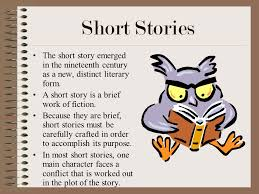

# Short stories for everyone

These individual short stories are the best of the best — and the even better news is that they're available for free online for you to peruse. From classics published in the 1900s to a short story that exploded in late 2017, here are ten of the greatest free short stories for you to read.

Check out the short stories:
1. [Hunted down]({{site.link1}})
2. [Nobody's story]({{site.link2}})

## Step 5: Manage your invoices and payment methods

Before you start working with resources in your account, familiarize yourself with where you can manage your payment method and access your invoices.
### Managing your payment method
    - To manage your payment method for an account that's billed in USD currency, go to *Manage > Billing and usage, and select Payments.
    - To manage your payment method for an account that's billed in non-USD currency, go to IBM Billing.

Accessing your invoices

    To access an invoice for an account that's billed in USD currency, go to Manage > Billing and usage, and select Invoices.
    To access an invoice for an account that's billed in non-USD currency, go to Manage > Billing and usage, and select Invoices. Then, click IBM Invoices.

